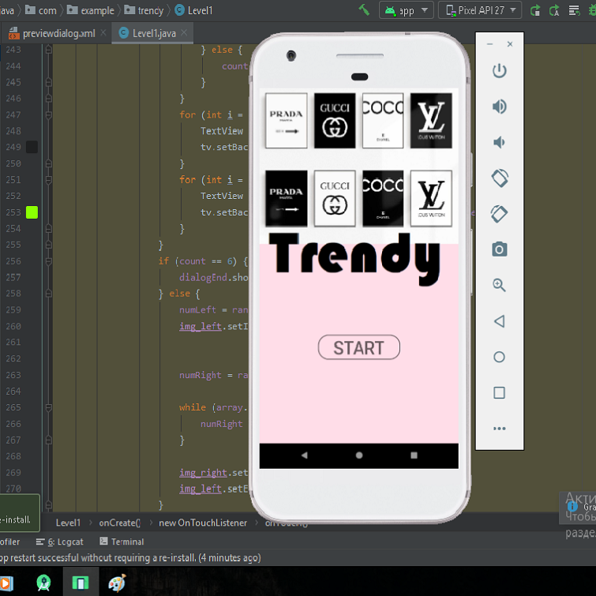

# Trendy
### Aplikacja na Androida
> Gra mobilna, która jest grą trendów i antitrendów, w której na każdym poziomie możesz w zabawny sposób sprawdzić swoją wiedzę na temat modnych ubrań. 

### Pierwszy poziom gry polega na wybraniu obrazka przedstawiającego modny strój z dwóch proponowanych obrazków
* na ekranie wyświetlane są dwa zdjęcia przedstawiające różne ubrania
* wybierz opcję, która wydaje Ci się modna i nowoczesna
* jeśli dobrze zgadłeś, to przejdziesz dalej
* jeśli się pomylisz - cofnisz się do tyłu
* aby pomyślnie ukończyć poziom, musisz przejść 6 kroków do przodu

### Strona główna aplikacji 
#### Aby rozpocząć grę, musisz nacisnąć „START”

`<Button
            android:id="@+id/buttonStart"
            android:layout_width="wrap_content"
            android:layout_height="wrap_content"
            android:layout_weight="5"
            android:background="@drawable/button_stroke_black95_press_white"
            android:paddingLeft="20dp"
            android:paddingRight="20dp"
            android:text="@string/start"
            android:textColor="@color/black95"
            android:textSize="35sp">
</Button>`

