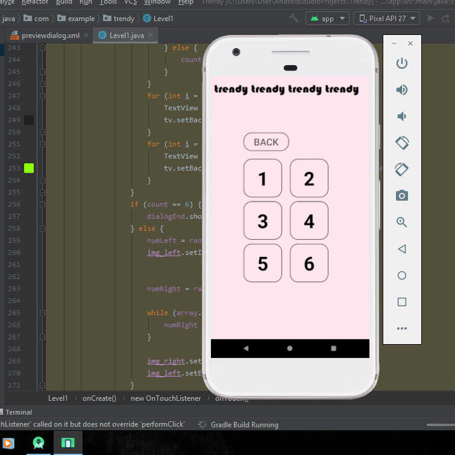
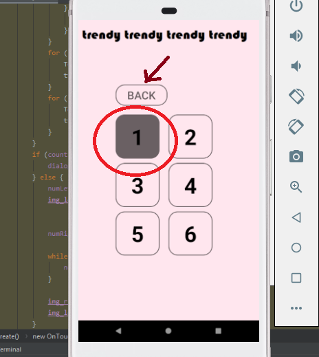
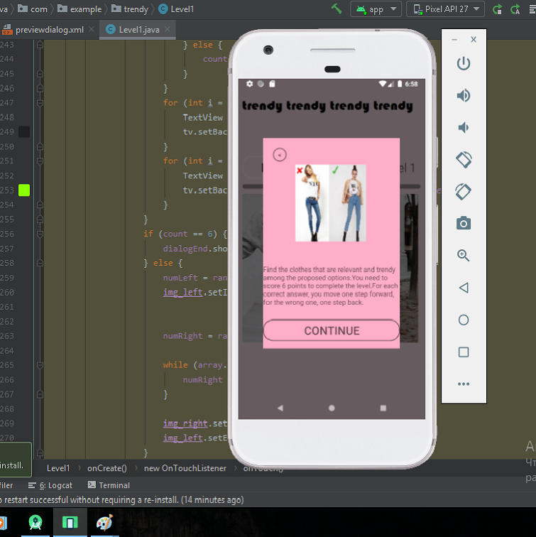
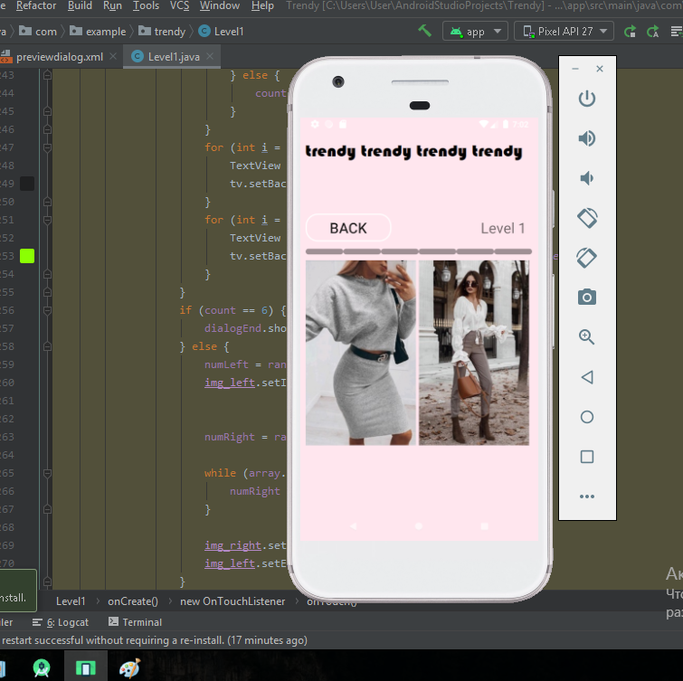
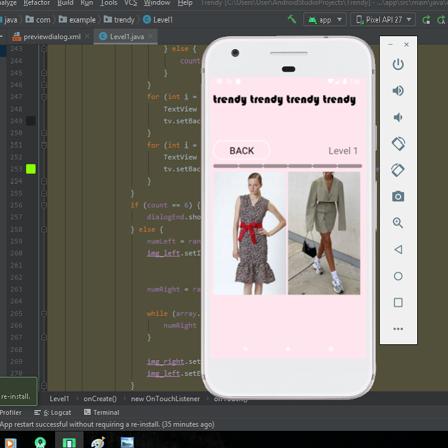
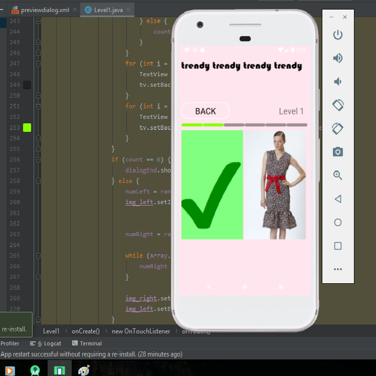
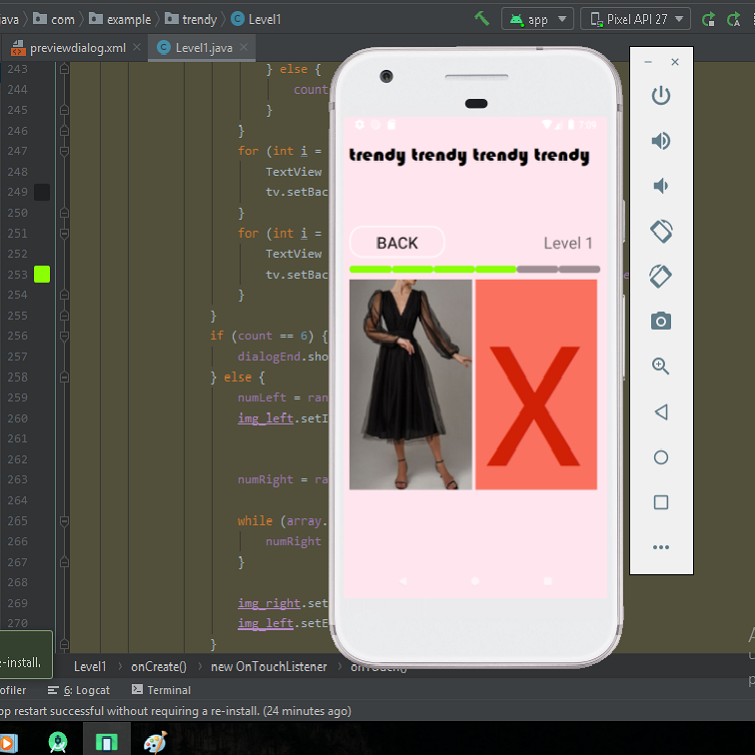
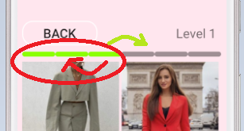
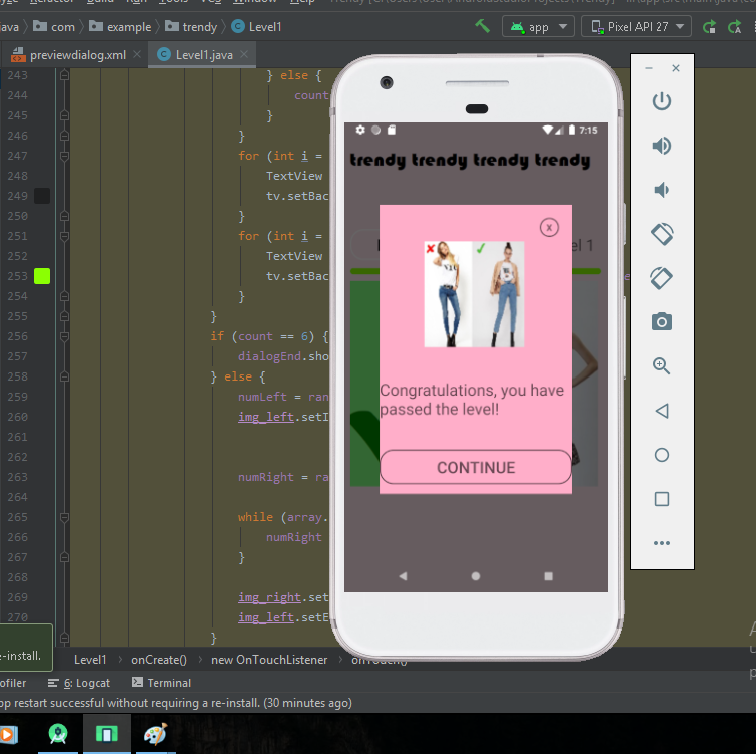

# Trendy
❗ Projekt znajduje się w master branche

### Aplikacja na Androida
> Gra mobilna, która jest grą trendów i antitrendów, w której na każdym poziomie możesz w zabawny sposób sprawdzić swoją wiedzę na temat modnych ubrań. 

### Pierwszy poziom gry polega na wybraniu obrazka przedstawiającego modny strój z dwóch proponowanych obrazków
* na ekranie wyświetlane są dwa zdjęcia przedstawiające różne ubrania
* wybierz opcję, która wydaje Ci się modna i nowoczesna
* jeśli dobrze zgadłeś, to przejdziesz dalej
* jeśli się pomylisz - cofnisz się do tyłu
* aby pomyślnie ukończyć poziom, musisz przejść 6 kroków do przodu

### Strona główna aplikacji 
#### Aby rozpocząć grę, musisz nacisnąć „START”

### Strona z poziomami
#### Zaimplementowaliśmy poziom 1 gry

##### Na tej stronie są dwie opcje:
 
* przycisk "1" - aby rozpocząć grę
* Back - aby powrócić do menu głównego

### Okiekno z zasadami gry
#### Po naciśnięciu przycisku 1 poziom wyskakuje okienko z zapisem zasad gry

##### Na na tej stronie też są dwie opcje:
* przycisk "<" - aby powrócić
* Continue - aby rozpocząć grę

### Gra Trendy

#### W aplikacji zdjęcia są generowane i wyświetlane losowo, jeden z modnym strojem, drugi z nieaktualnym

##### Opcje na tej stronie:
* wybrać i kliknąć na jedno ze zdjęć
* Back - aby powrócić do menu głównego

##### Przykłady losowych wyświetleń:

#### ✔ jeśli odpowiesz poprawnie - pojawi się zielony znacznik wyboru i przejdziesz o krok do przodu

#### ✖ jeśli odpowiesz niepoprawnie - zostanie wyświetlony czarny krzyżyk i przejdziesz o krok do tyłu

### Poziomy gry

### Okiekno z zasadami gry
#### Po osiągnięciu ostatniego poziomu pojawia się okienko z gratulacjami

##### Są dwie opcje:
* przycisk "✖" - w celu zamknięcia
* Continue - aby przejść dalej

